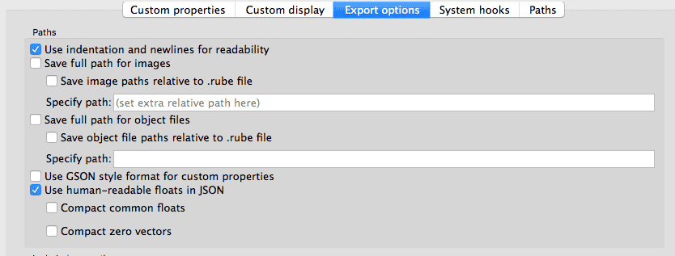
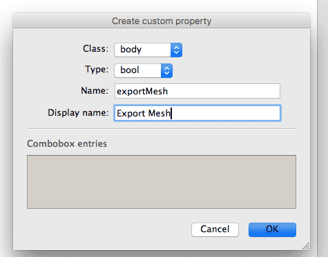
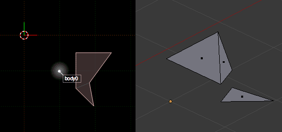
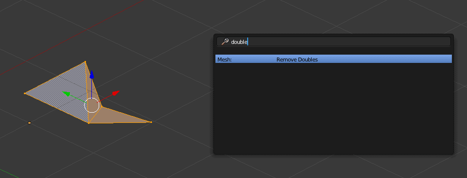

## Rube > Collada

This JS libs allowed conversion from rube exported json file to Collada file. It create for each body of a mesh included all its fixtures (only polygon and circle supported).


### Example
```js

const rubeToCollada = require("rubeToCollada");

rubeToCollada(
    "rube.json",    // your rube raw json file
    "collada.json", // your collada exported file
    filter   // filter options 
   
    )

```

### Rube settings

In scene settings > Export options : Compact zero vector and Compact, Compact common float has to be deselected. 




### Filter

By default parse only take bodies which has the custom properties "exportMesh" to true.

You can create this custom property in rube in scene settings > Custom properties



Or you can set the filter option to false 

```js

const rubeToCollada = require("rubeToCollada");

rubeToCollada(
    "rube.json",    // your rube raw json file
    "collada.json", // your collada exported file
    false   // filter options 
   
    )

```

### More details

The lib use this other lib to convert quad to triangles : [Earcut](https://github.com/mapbox/earcut)

As rube already split fixtures into differents quads when it exportes some vertices are duplicated. 



In tools like blender you can simply use the remove doubles tools :




